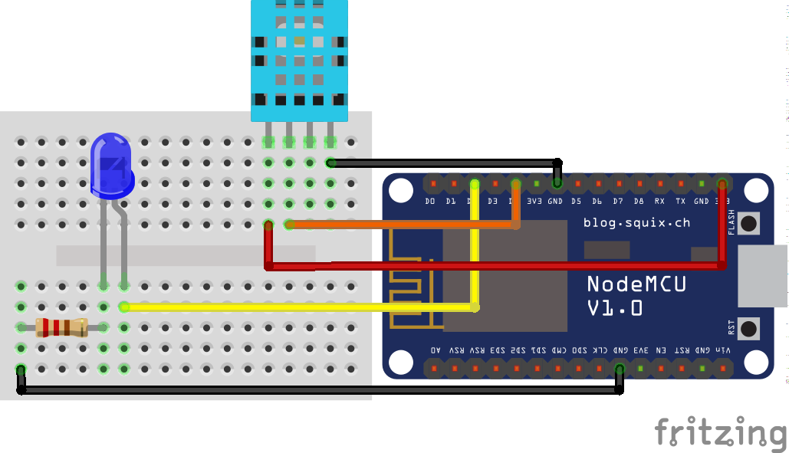
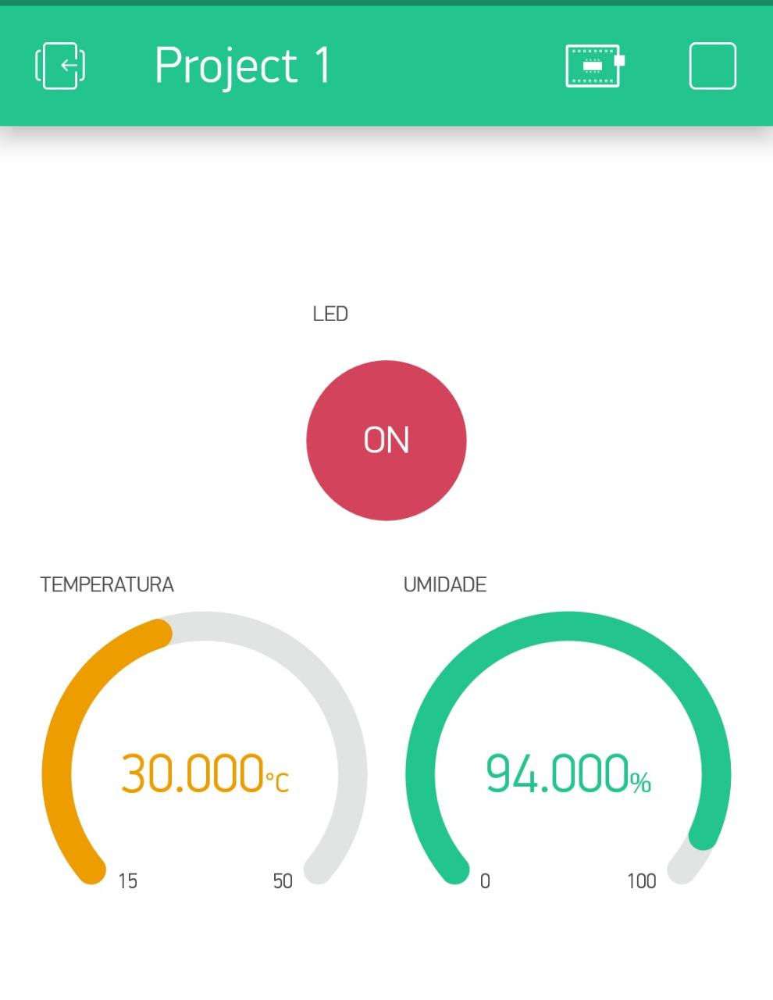
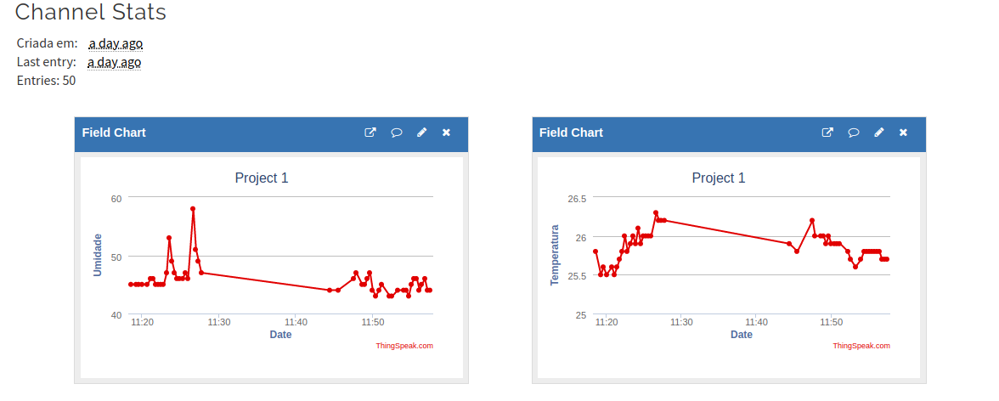

# Temperatura e Umidade com IOT
Projeto de leitura de temperatura e umidade ambiente usando o Sensor DHT11, com envio dos dados ao Blynk e a plataforma Thingspeak, e acionamento de led através do Blynk.

## Montagem do circuito
Para a montagem do circuito foram utilizados:
  * nodeMCU 
  * sensor DHT11
  * led| width=50)
  * resistor 220 ohms
  * protoboard
  * jumpers
  

 > Na pasta img é possível obter o arquivo do esquemático do circuito feito no Fritzing, bem como a imagem do circuito real montado.
 
## Configuração do Blynk
No app Blynk configure como abaixo:
   * Botão para acionamento do led: Pino Digital -> D2 e Modo Switch
   * Temperatura: Pino Virtual V5 
   * Umidade: Pino Virtual V6
Os pinos virtuais devem ser os mesmos especificados no código .ino

## Resultados

